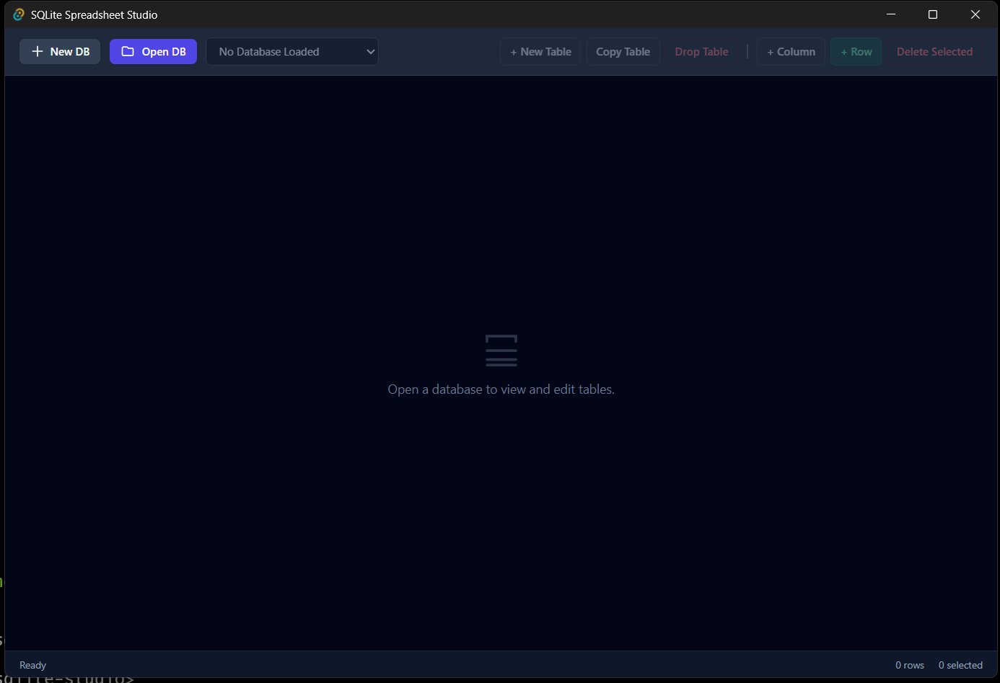

# SQLite Studio (Tauri v2)

A fast, lightweight, and modern desktop spreadsheet editor for SQLite databases built with **Tauri v2**, **Rust (`rusqlite`)**, and **Tailwind CSS**.



## Features

- **Zero-Config Database Management:** Open existing `.db`, `.sqlite`, `.sqlite3` files or generate new empty databases directly.
- **Visual Table & Schema Operations:** Create tables, duplicate schemas with data, add columns dynamically, and drop tables safely.
- **Spreadsheet Grid:** Responsive bidirectional scrolling with inline double-click cell editing.
- **Batch Row Management:** Insert single rows with dynamic column schemas and delete multiple selected rows simultaneously.
- **Secure & Native:** Robust SQL parameterization and identifier sanitization handled safely via Rust backend commands.

## Prerequisites

- [Node.js](https://nodejs.org/) (v18+)
- [Rust & Cargo](https://www.rust-lang.org/)
- MSVC C++ Build Tools (on Windows)

## Getting Started

1. **Clone the repository:**
   ```bash
   git clone [https://github.com/](https://github.com/)<your-username>/sqlite-studio.git
   cd sqlite-studio
   ```
   
2. **Install frontend dependencies:**
   ```bash
   npm install
   ```
   
3.	**Run in development mode:**
   ```bash
   npm run tauri dev
   ```
   
4.	**Build production standalone executable:**
   ```bash
   npm run tauri build
   ```
---

## Authorship & Copyright

Copyright (c) 2026 Kevin. All rights reserved.

This project is authored and maintained by **Kevin**, developed iteratively across two major architectural versions:

- **v1.0 (Legacy Python/Tkinter):** Conceptualized and developed with AI workflow assistance from **OpenAI ChatGPT**.
- **v2.0 (Modern Tauri/Rust Desktop Studio):** Redesigned and refactored for high performance with architecture and engineering assistance from **Google Gemini**.

---
   
## License

This project is licensed under the GNU General Public License v3.0 - see the [LICENSE](LICENSE) file for details.

